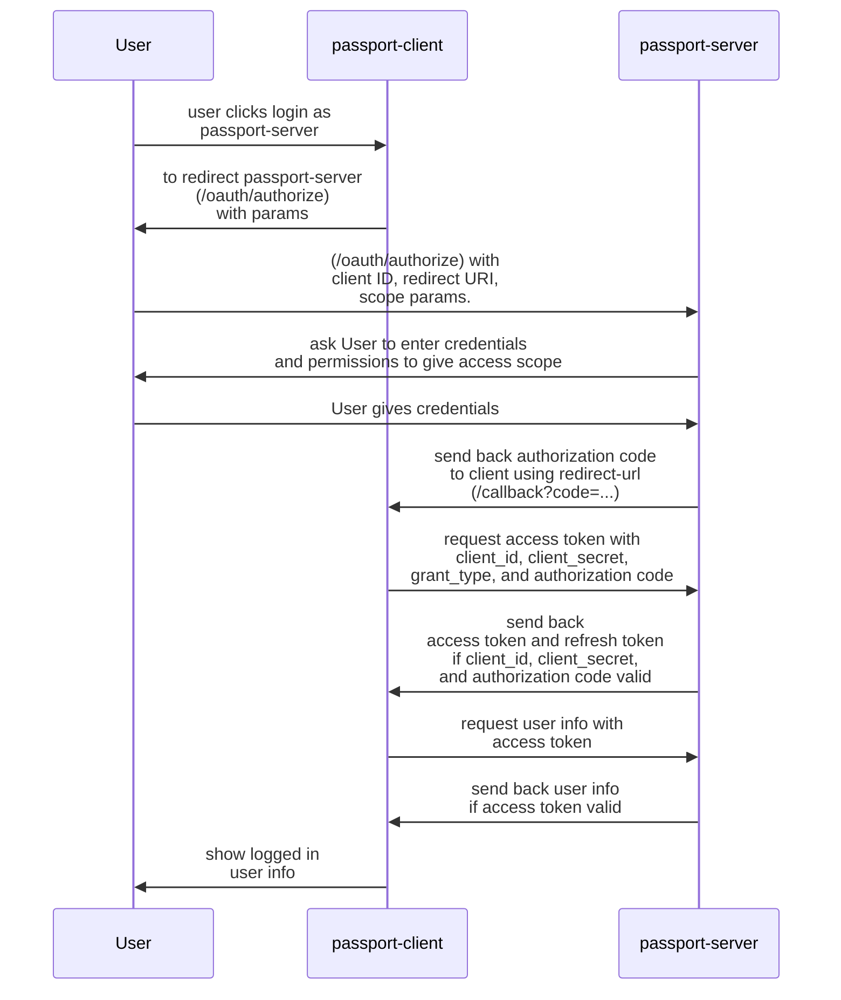

# Passport OAuth Server

The **Passport-Server** project is an OAuth 2.0 authentication server built with Laravel Passport and Laravel Filament, providing secure login and token management for client applications like Passport-Client.

## Demo

- Explore the demo: [YouTube](https://youtu.be/I_8JTz8vass?si=7bpvZc2AQ1d8m_Wc) (Timestamps on description)
- passport server : [https://passport-server.fly.dev/](https://passport-server.fly.dev/)
- passport client : [https://passport-client.fly.dev/](https://passport-client.fly.dev/)
- [reference](https://medium.com/@vidura.prasangana16/what-is-oauth-2-0-476aabded278)

## Technologies

- Laravel
- Passport
- Laravel Filament

### Workflow Overview

1.  **Login Button Click** (Passport-Client):

    - User clicks the "Login as Passport-Server" button on the Passport-Client login page.
    - The client redirects the user to the Passport-Server's authorization endpoint, including a query string with the **client ID**, **redirect URI**, and **scope**.

2.  **Authenticate on Passport-Server**:

    - If the user is **not already logged in** on Passport-Server, they are prompted to log in (e.g., email and password form).
    - Once logged in, Passport-Server asks for user consent (if applicable) to share their profile with Passport-Client.

3.  **Authorization Code Issued**:

    - Upon successful login and consent, Passport-Server redirects the user back to the Passport-Client's **redirect URI**, along with an **authorization code**.

4.  **Authorization Code Exchanged for Token**:

    - Passport-Client sends the authorization code, along with its client ID and client secret, to Passport-Server's token endpoint.
    - If valid, Passport-Server responds with an **access token** (and optionally a refresh token).

5.  **User Logged In**:

    - Passport-Client uses the access token to fetch the user profile from Passport-Server's user info endpoint.
    - Passport-Client creates a session for the user, completing the login process.

## Features

#### On Passport-Server:

- OAuth 2.0 authentication services for secure login.
- A **Posts** section for users to write and manage their content.
- A **Dashboard** to manage users, clients, and tokens.
- Ability to **revoke client tokens** for enhanced security and control.

#### On Passport-Client:

- Integration with Passport-Server for seamless user authentication.
- A **Products** section for users to manage product listings.

## Implementations

- **Laravel Filament** : Using Laravel Filament to provide an elegant admin interface for managing OAuth clients, users, and tokens.

#### On Passport-Server:

- **Authorization Endpoint**: Validates the client, authenticates the user, and issues an authorization code.
- **Token Endpoint**: Exchanges the authorization code for an access token.
- **User Info Endpoint**: Provides user details when queried with a valid access token.

#### On Passport-Client:

- **Login Flow**: Initiates the OAuth flow by redirecting to Passport-Server.
- **Callback Handling**:
  - Processes the authorization code and retrieves the access token.
  - Uses the token to fetch user details and establish a session.

## Challenges

1.  **Token Security**: Ensuring the secure storage and handling of tokens on both server and client sides.
2.  **OAuth Flow Complexity**: Implementing and debugging the complete OAuth 2.0 Authorization Code Grant flow.
3.  **User Experience**: Maintaining a seamless user experience during redirections between Passport-Client and Passport-Server.
4.  **Token Revocation**: Properly handling token revocation and ensuring affected sessions are invalidated.
5.  **Admin Panel Customization**: Adapting Laravel Filament for specialized management tasks like token monitoring and user actions.

## System Design

### License

This project is licensed under the MIT License – see the [LICENSE](./LICENSE) file for details.
